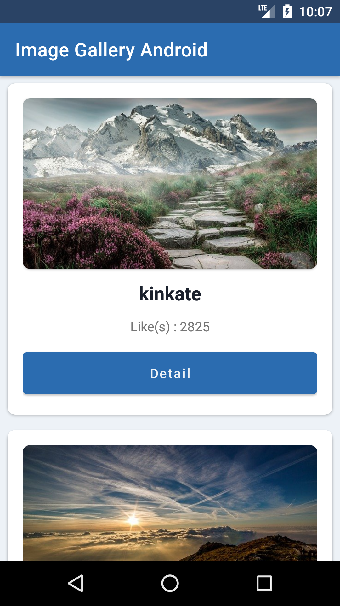

# Image Gallery Android App

## Preview

## To run this app on your Android Studio

1. Clone this repository  
   `git clone https://github.com/hendraaagil/ImageGalleryAndroid.git`
2. Open on your Android Studio.
3. Make class file `Constant.java` on `app/src/main/java/com/imagegallery`.
4. Then, add static variable called `API_URL` which is Pixabay API URL with your API Key.
5. Sync gradle.

You can download and install released APK at [here](https://github.com/hendraaagil/ImageGalleryAndroid/releases/download/v1.0/Image.Gallery-release-unsigned.apk).

Thanks.
